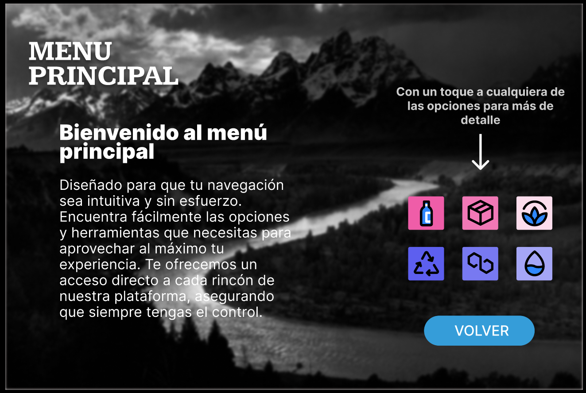
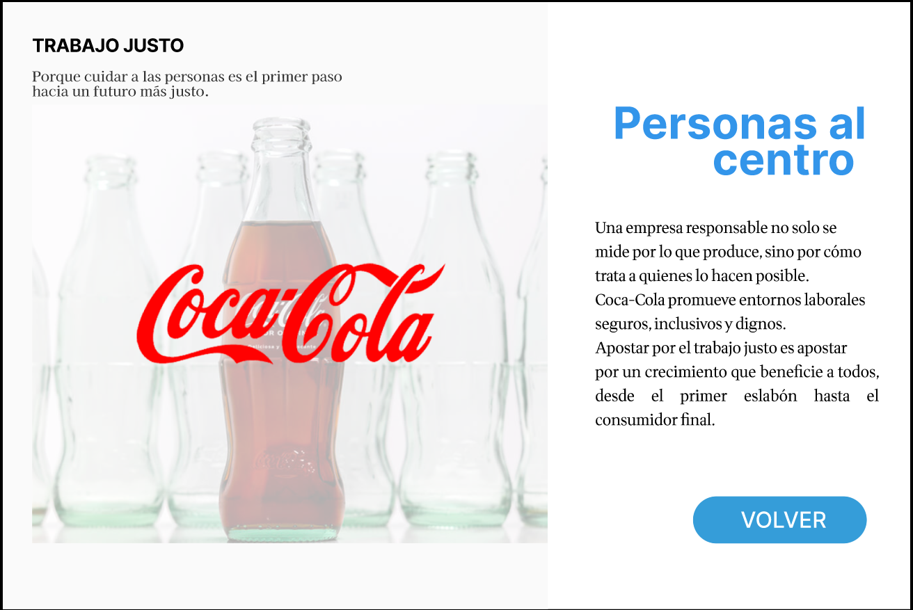
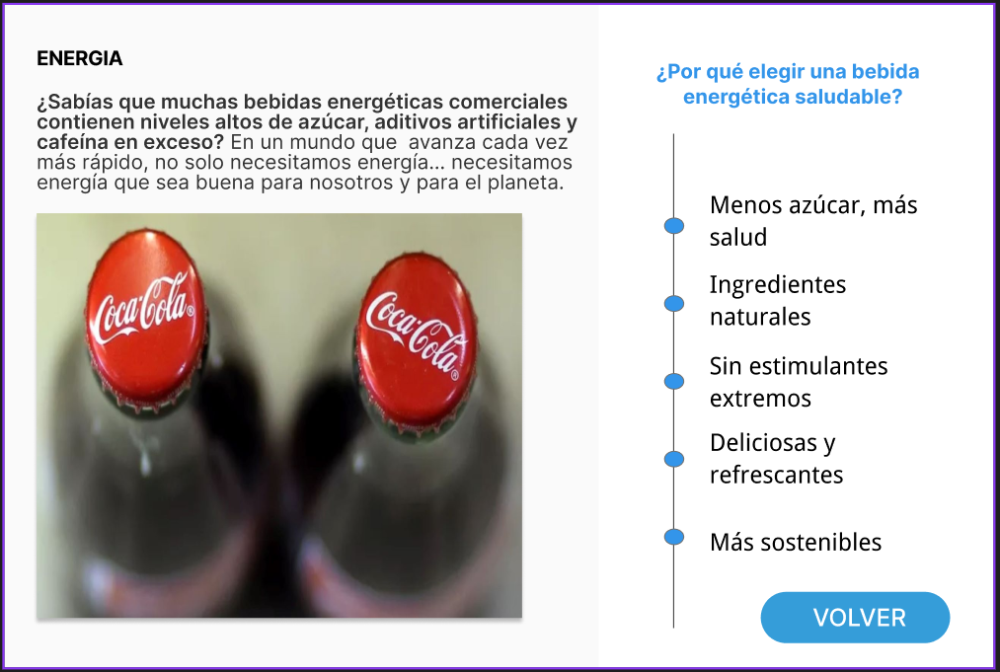
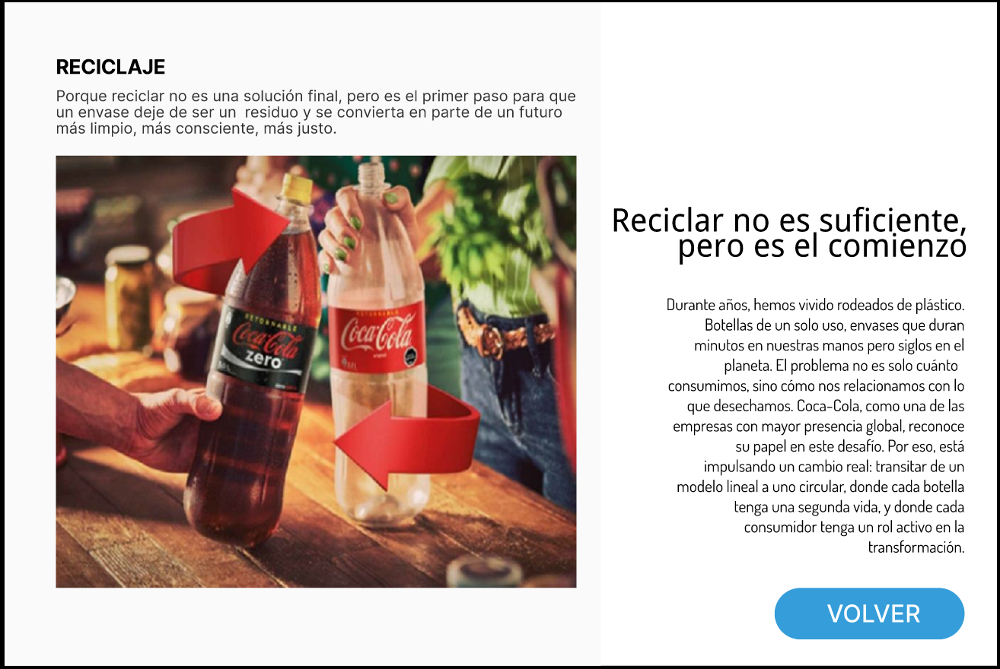
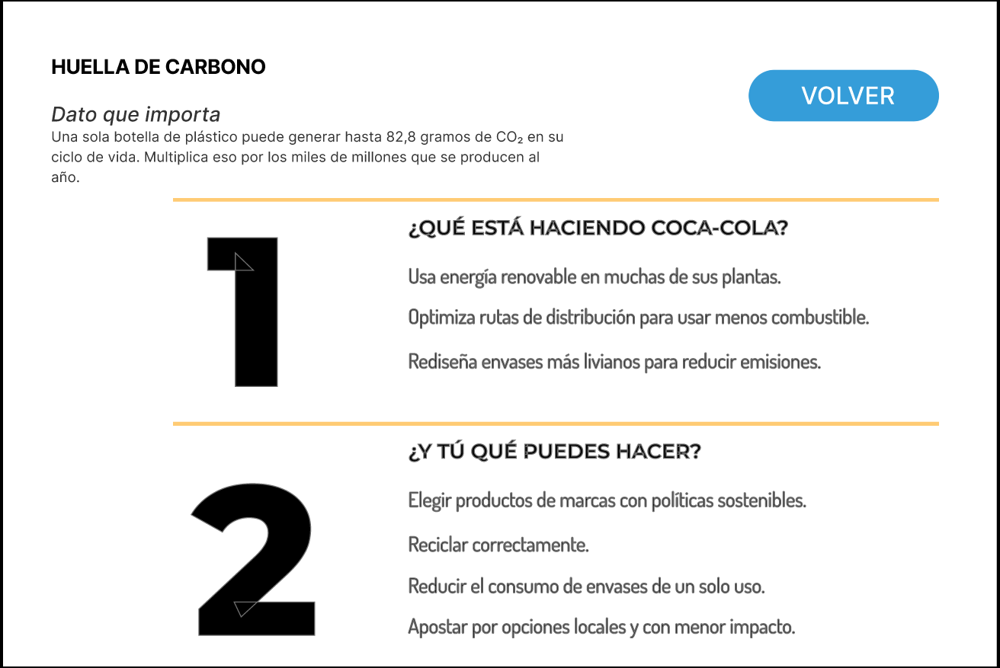
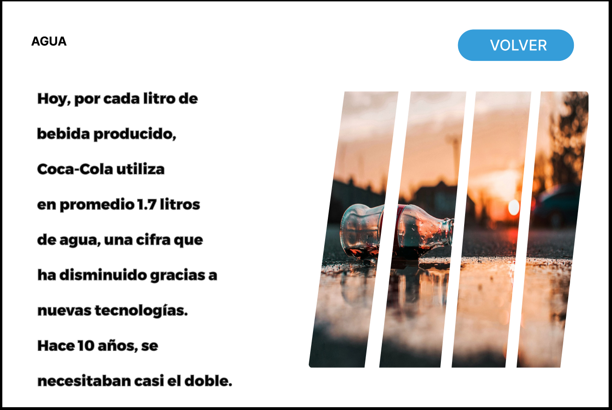

# Prototipo en Figma – Coca-Cola: Refrescamos al mundo con responsabilidad

Este proyecto consiste en un **prototipo de interfaz diseñado en Figma**, con temática de Coca-Cola y bebidas saludables.  
El objetivo fue crear una experiencia de usuario **intuitiva, atractiva y funcional**, integrando un menú principal con accesos directos y flujos de navegación claros.

## Descripción
Más allá de una simple bebida, Coca-Cola es presentada como un símbolo refrescante que inspira optimismo y celebra los momentos cotidianos.  
El prototipo incluye secciones como:  
- **Menú principal** con navegación fluida.  
- **Bebidas saludables**, destacando opciones sin azúcar.  
- **Reciclaje y huella de carbono**, fomentando sostenibilidad.  
- **Datos que importan**, con información clara y visual.  

## Tecnologías / Herramientas
- Figma (Diseño y Prototipado)  
- UX/UI Design  

## Capturas
  
  
  
  
  
  
  

## Prototipo Online
🔗 [Ver en Figma](https://www.figma.com/design/IvrIadRTM2Gup8FgaQZXyq/Trabajo?node-id=1-158&t=8khZfPH59dEFEx1n-1)  

